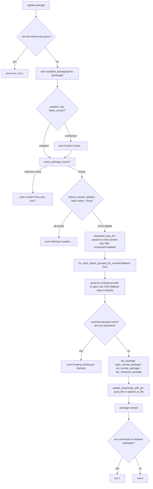

# CLI: `commands.rb` and `npm.rb`

## 1. The command path

`bin/importmap` (`Importmap::Commands < Thor`, `lib/importmap/commands.rb`) is
the only place this gem talks to the network. Every subcommand calls into
`Importmap::Packager` (`lib/importmap/packager.rb`) for CDN resolution and
vendoring, or `Importmap::Npm` (`lib/importmap/npm.rb`) for the npm registry;
both write only to `vendor/javascript` (`Packager#download` /
`#save_vendored_package`) and `config/importmap.rb` (`Commands#update_importmap_with_pin`,
via `Thor::Actions#gsub_file` / `#append_to_file`). The engine, `Importmap::Map`
and the view helpers never call `Packager` or `Npm` and never do I/O beyond
the asset resolver — request path and command path are disjoint, as `CLAUDE.md`
states and the `require` graph confirms (`commands.rb` requires
`importmap/packager` and `importmap/npm`; `map.rb`/`engine.rb` require neither).

## 2. Every command

| Command | Options (default) | Prints (verbatim; `pluralize`d nouns shown as singular/plural) | Writes | Exit on failure |
|---|---|---|---|---|
| `pin [*PACKAGES]` | `--env/-e` ("production"), `--from/-f` (nil), `--preload` (repeatable), `--remote` (false), `--minify` (nil), `--lock` (nil), `--force` (false), `--vendor` (false) | `Resolved "#{name}" to #{latest} from the npm registry`; `Pinning "#{package}" to #{vendor_path}/#{package}.js via download from #{url}#{" (minified)" if minify}#{" (with N sibling files)" if a graph}`; `Note: the graph of "..." already maps "..."`; `Pinning "#{package}" to #{url}#{" (kept remote: ...)" if kept_remote}`; `Locked "#{package}" at #{version}`; `Skipping "..." (locked at ...)`; `Skipping "<pkg>": <dir> exists and no pin_all_from line maps it as a graph; …` / `Skipping "<pkg>": <HTTPError message>`; `Couldn't find any packages in ... on ...` | pin line(s) in `config/importmap.rb`; `vendor/javascript/<file>.js` (plus `vendor/javascript/<file>/` and its `pin_all_from` line for a graph) unless `--remote`/kept remote | `exit 1 if skipped.any?` — a package skipped because its directory is in the way or its CDN failed (`Skipping "<pkg>": …`) leaves the pin untouched and fails the command; a resolution `Packager::Error` still escapes as a backtrace and exits 1 |
| `lock [*PACKAGES]` | none | `Use "bin/importmap pin #{spec} --lock" ...`; `Couldn't find a pin for "..."`; `"..." is already locked at ...`; `Can't lock "...": its pin has no version`; `Locked "..." at ...` | adds `(locked)` to the pin's provenance comment | `exit 1 unless packages.map { lock_package }.all?` |
| `unlock [*PACKAGES]` | none | `Couldn't find a pin for "..."`; `"..." isn't locked`; `Unlocked "..."` | drops `locked` from the provenance comment | `exit 1 unless packages.map { unlock_package }.all?` |
| `unpin [*PACKAGES]` | `--env/-e` ("production"), `--from/-f` ("jspm") | `Unpinning and removing "#{package}"` | removes pin line + vendored file + graph directory and its line (`Packager#remove`) | none explicit |
| `pristine` | `--env/-e` ("production"), `--from/-f` (nil → each pin's own CDN), `--minify` (nil → each file's own state) | `Skipping "..." (pinned to remote URL)`; `Skipping "..." (locked at ..., CDN resolved ...)`; `Downloading "#{package}" to #{vendor_path}/#{package}.js from #{url}#{" (minified)" if minify}`; `Couldn't restore "...": it ...` | re-downloads vendored files, re-crawls the graph of a pin that maps one and drops the line of one that no longer does; rewrites provenance comment only if provider/minified changed | `exit 1` if any package couldn't be restored, or an esm.run bundle's dependency was skipped on the way (`unrestored.any? \|\| skipped.any?`) |
| `json` | none | full importmap as JSON (`Rails.application.importmap.to_json`) | nothing | raises if `config/environment` fails to load |
| `audit` | none | table `Package/Severity/Vulnerable versions/Vulnerability`; `  #{n} vulnerabilit{y,ies} found: ...`; or `No vulnerable packages found` | nothing | `exit 1` if any vulnerable package found |
| `outdated` | none | table `Package/Current/Latest/Locked`; `  #{n} outdated package(s) found#{" (#{locked} locked)" if any}`; or `No outdated packages found` | nothing | `exit 1 if locked.size < outdated_packages.size` |
| `update [*PACKAGES]` | `--all` (false), `--force` (false) | `Pass package names or --all, not both`; `Couldn't check "#{p.name}": #{p.error}`; `No outdated packages found`; `Nothing to update (every outdated package is locked; pass --force)`; plus `pin_package`'s sentences | rewrites pins for eligible keys | `exit 1` if `--all`+names both given, a named package unknown, any package unchecked, or any package skipped (`skipped.any?`, as in `pin`) |
| `packages` | none | one line per `"#{name} #{version}"` | nothing | none |

`Commands.exit_on_failure? = false` (`commands.rb:9-11`) governs `Thor::Error`
only, and it means Thor prints the message and does *not* exit: `Thor::Base.start`
calls `exit(false)` only when `exit_on_failure?` is true, so a command that ends
by raising `Thor::Error` finishes with status 0 unless it called `exit` itself
(`outdated` and `update` do). `Packager::Error` and its `ServiceError` subclass
are plain `StandardError`s (`packager.rb:66-68`), so one that escapes a command
propagates past Thor, prints a backtrace and exits 1. The places that catch
them first (`grep -n "rescue Importmap::Packager" lib/importmap/commands.rb` is
the authoritative list): `pin_vendored_package` rescues the `Unvendorable` and
`NotAnEsModule` subclasses into a remote pin (`commands.rb:220-221`), then
`VendoredGraph::Occupied` and any other `Packager::Error` from the download into
`skip` — a printed `Skipping "<pkg>": …` and an entry in `skipped`, which `pin`,
`update` and `pristine` turn into `exit 1` (`commands.rb:222-231`, `#skip`; a package skipped once and pinned later in the same run is dropped from the record by `update_importmap_with_pin`);
`restore_package` rescues the same pairs into `Couldn't restore "<pkg>": …` and
`false`, which `pristine` turns into `exit 1` (`commands.rb:292-297`);
`remote_integrity_for` rescues the fetch that hashes a remote pin into
`Couldn't hash <url> …; pinning it without an integrity hash` and `nil`;
`ProviderChain#resolve` rescues per provider and re-raises only the last
(`provider_chain.rb:64`); and `resolve_url_from_provider` (§3) downgrades one to
a printed sentence and `nil`. So no `Packager::Error` raised by a *download*
reaches Thor; only a resolution failure does.

## 3. `pin` in detail

**No version given** — `resolve_latest_versions` (`commands.rb:455-467`)
matches each spec against `Packager::PACKAGE_SPEC_REGEXP`; if it has no
version, it asks `Npm#latest_version(name)` (`npm.rb:49-53`, the registry's
`dist-tags.latest`, else the highest `versions.keys`) and rewrites the spec
via `packager.package_spec_for(spec, "@#{latest}")` *before* the CDN sees it —
"so falling back to another CDN can't quietly land the app on a different
one." An unreachable registry leaves the spec untouched.

**`--from` and the fallback chain** — `for_each_import_grouped_by_provider`
(`commands.rb:423-431`) groups by `from || vendored_provider_for(spec) ||
Importmap::ProviderChain::DEFAULT` ("jspm"). A group with no provider of its
own goes through `for_each_import_with_fallback` (`commands.rb:438-447`) →
`ProviderChain#resolve` (`provider_chain.rb:56-75`): jspm, then esm.run, then
jsdelivr (`PROVIDERS`), printing `"#{provider} couldn't resolve ...; trying
#{next_provider}"` on each miss. An explicit `--from` or a pin's own recorded
provider is asked once, no fallback (`for_each_import`, `commands.rb:594-602`).
`vendored_provider_for` (`commands.rb:476-483`) reads a bare key's
`pin_provenance(key)[:provider]`; a subpath asks `provider_of_pin`
(`commands.rb:490-493`) of the key then the package name, falling back to
`packager.provider_for_url` on an unlocked remote pin's `to:` URL.

**`--minify`** — `pin_vendored_package` (`commands.rb:205-222`) defaults
`minify` to `vendored_minified?(package)` (existing provenance) when omitted;
`Packager#download(..., minify:)` then runs `Minifier` before writing, so
later calls with no `--minify` keep minifying.

**`--lock`** — `pin_package` (`commands.rb:184-201`) computes `locked =
lock.nil? ? packager.locked?(package) : lock`: an explicit `--lock`/`--no-lock`
applies only to specs named on the command line (`requested`, via
`packager.package_key_for`), not CDN-resolved dependencies. `without_locked`
(`commands.rb:267-275`) drops already-locked specs up front unless `--force`
or `--lock`/`--no-lock` was passed.

**`--remote` / `--vendor` and the single-file check** — `pin_package` picks
`repin_remote_package`, `pin_remote_package`, or `pin_vendored_package`
depending on whether the pin already has a remote `to:` and whether `vendor`
is set (`vendor ||= packager.vendored?(package)`, so `--vendor` sticks on
later rewrites). `pin_vendored_package` → `Packager#download`, which unless
`force:` (true for `--vendor`/`pristine`) runs `ensure_servable`
(`packager.rb:563-568`) via `Importmap::ModuleInspector` (relative/dynamic
imports, workers, `import.meta.url`, `.wasm` → not vendorable; also checks ES
module). Failure raises `Unvendorable` → `pin_remote_package(kept_remote:
error.reasons)`, or `NotAnEsModule` → `kept_remote: ["not an ES module"]`.
`--vendor` overrides the check, but only for the packages named on the command
line, not for the dependencies a CDN resolves alongside them — except a
dependency whose own pin already says `(vendored)`, which keeps `vendor` on
through `vendor ||= packager.vendored?(package)`; `--remote` wins when both flags
are passed (`review/cli.md`).

**Existing provenance honoured** — `pin_package` reads
`extract_existing_pin_options(package)[package]` first, carrying forward
`preload` (if none passed) and `integrity` unchanged; `vendored_pin_for`/
`pin_for` re-emit the comment without dropping details the rewrite doesn't
touch.

**CDN-resolved dependencies** — `keep_locked_dependency` (`commands.rb:362-367`)
skips any resolved package that is locked and wasn't requested, printing
`Keeping existing pin for "..." (locked at ...)`. For esm.run,
`pin_esm_run_dependencies` (`commands.rb:381-389`) walks the `[package, url]`
pairs `Packager#download` returns (imports rewritten to bare specifiers by
`rewrite_esm_run_imports`), keeping a pin the app already has or pinning a new
one via `pin_package`.

## 4. `update`

Bare `update` re-pins every outdated, unlocked, versioned pin; named
`update <names>` restricts to those; `--all` is the same as bare per its
`desc`, and both together prints `Pass package names or --all, not both` and
exits 1 (`commands.rb:136-139`). `--force` includes locked packages, keeping
each lock at the new version.

`npm.outdated_packages(only: packages.presence)` partitions into
`outdated_packages` (has `latest_version`) and `unchecked_packages` (registry
error) — unchecked ones print `Couldn't check "...": ...` but don't stop the
rest ("each pin is independent", `commands.rb:141-146`). `every_package_known?`
(`commands.rb:371`) validates named packages, printing `Couldn't find a
pin for "..."` (fails the command), `"..." is already up to date (...)`, or
`Can't tell whether "..." is outdated: its pin has no version` (neither fails
it).

`without_locked_updates` (`commands.rb:355`) drops locked names unless
`--force`. Remaining names resolve to import-map **keys** — only versioned
pins count, since an unversioned subpath pin "404s the whole batch"
(`commands.rb:339-342`): named packages use `requested_keys_for`
(`commands.rb:400`, every pinned key sharing that package name via
`keys_for`/`versioned_keys_by_package`, filtered to outdated); bare/`--all`
use `outdated_keys_for` (`commands.rb:423`, same grouping) — so a
subpath pin like `photoswipe/lightbox` moves in place rather than gaining a
new bare `photoswipe` pin.

Those keys run through `for_each_import_grouped_by_provider(fallback: true)`
and `pin_package(package, url)` (no explicit `lock:`, so it reads the pin's
own `locked?`), skipping locked dependencies via `keep_locked_dependency`.
`exit 1 if unchecked_packages.any? || skipped.any?` (`commands.rb:168`) even
when the rest updated successfully.

## 5. `pristine` and `unpin`

`pristine` (`commands.rb:64-84`) re-downloads every pin `npm.packages_with_versions`
knows, via `for_each_import_grouped_by_provider` with **no** `fallback:` — "a
pin that moved to another CDN would be a rewrite, not a restore." Skips remote
pins and locked pins whose CDN-resolved version drifted
(`version_drift_of_locked`); otherwise downloads with `force: true` (bypasses
the single-file check on purpose) and rewrites the provenance comment only if
`provenance_changed?` (provider/`minified` differ) — integrity and other
options untouched.

`unpin` (`commands.rb:48-58`) resolves each spec through the same CDN lookup
just to iterate `response[:imports]`; for each `packager.packaged?` package it
prints `Unpinning and removing "#{package}"` and calls `packager.remove`,
which deletes the vendored file and strips the pin line
(`remove_package_from_importmap`, a `grep_v` rewrite — the one write path
that isn't `gsub_file`/`append_to_file`).

## 6. Npm

`Importmap::Npm` talks only to `registry.npmjs.org` (`base_uri` class
accessor), via `get_json`/`post_json`, both wrapped in `with_retries`
(`HttpRetries`, included) raising `HTTPError` (`npm.rb:112-133`, `169-177`).

- `outdated_packages(only: nil)` (`npm.rb:24-44`): builds an `OutdatedPackage`
  per candidate from `packages_with_versions` (or `only`, matched by
  `extract_base_package_name`); `get_package` failures are recorded as
  `.error` rather than raised, so one bad package doesn't stop the batch.
  `find_latest_version` prefers `dist-tags.latest`, else the highest
  `Gem::Version` among `versions.keys`.
- `audit`/`vulnerable_packages` (`npm.rb:55-66`) POSTs every
  `packages_with_versions` to `/-/npm/v1/security/advisories/bulk`, mapping
  the response into `VulnerablePackage` structs sorted by `[name, severity]`.
- `packages_with_versions` (`npm.rb:70-87`, memoized) scans `config/importmap.rb`
  for CDN-URL versions and the vendored `# @version` comment pattern;
  `vendored_packages_without_version` (`npm.rb:190-196`) prints `Ignoring
  #{package} (#{path}) since no version is specified in the importmap` for a
  vendored file with no version anywhere (informational).
- `get_package` (`npm.rb:97-110`) rescues `HTTPError` (retries spent) into
  `{"error" => message}`, so `outdated_packages`/`latest_version` degrade per
  package instead of aborting.

`base_uri` and retry counts (`HttpRetries.attempts = 3`, `.wait = 0.5`,
growing `wait * attempt`) are shared with `Packager` — both `include
Importmap::HttpRetries`.

## 7. Provider names and hosts

`Packager::PROVIDER_HOSTS` (`packager.rb:19-25`):

| Host | Provider |
|---|---|
| `ga.jspm.io` | `jspm.io` |
| `unpkg.com` | `unpkg` |
| `cdn.jsdelivr.net` | `jsdelivr` |
| `cdn.skypack.dev` | `skypack` |
| `esm.sh` | `esm.sh` |

Plus `esm.run` (`ESM_RUN_PROVIDER`), detected by URL shape (`ESM_RUN_URL_REGEXP`,
jsDelivr's `/npm/.../+esm` endpoint), not host, since its host is also
`cdn.jsdelivr.net`. `DEFAULT_PROVIDER = "jspm.io"`; `provenance_comment`
(`packager.rb:403-412`) appends a `provider` detail only `if provider !=
DEFAULT_PROVIDER` — this is what "jspm.io is the default provider and is
omitted" means: a jspm-resolved pin's comment is `# @3.7.2`, never
`# @3.7.2 (jspm.io)`. `--from jspm`/`option :from` normalize to `"jspm.io"`
for the API call (`normalize_provider`); `ProviderChain.normalize` maps back
so the chain and a pin's recorded provider compare equal.

## 8. Invariants and contracts

- Errors on one package never abort a batch — `npm_test.rb:284` (stubbed), `commands_test.rb:727` (live).
- `--lock`/`--no-lock` applies only to requested packages, not CDN-resolved deps — `commands_test.rb:451`, `:461` (live).
- Bare `update` moves a subpath pin, not a new bare pin — `commands_test.rb:614` (live).
- An unversioned local subpath pin is left alone by `update` — `commands_test.rb:645` (live).
- `pristine` never falls back across CDNs — `commands_test.rb:1020` (live).
- `pin`/`update` fall back on a jspm miss; an explicit `--from` doesn't — `commands_test.rb:934` vs `:947` (live).
- A download that can't stand alone is kept remote, never silently vendored/failed; `--vendor` overrides — `commands_test.rb:761`, `:983`, `:774`, `:995` (live).
- A version-less spec resolves via the npm registry, not the CDN — `commands_test.rb:959` (live).
- `outdated_packages` and `latest_version` degrade when the registry is unreachable (the error is recorded on the package, `npm_test.rb:261`, `:284`; `latest_version` returns nil, `:329`); `vulnerable_packages` raises through `post_json`, so `audit` never reports a clean bill it cannot vouch for (`review/cli.md`).
- Retries are bounded and shared — `npm_test.rb:245` (stubbed).
- Live network contracts: `npm_integration_test.rb` (4 cases) and every `commands_test.rb` case (`CommandsTest` shells out to real `bin/importmap` inside a forked `ActiveSupport::Testing::Isolation` process per test, `commands_test.rb:1-15`). Stubbed: all of `npm_test.rb` except the integration file.

## 9. `update <package>` flow

## 10. Related

- `../packager/summary.md`
- `../inspection-and-tools/summary.md`
- `../review/cli.md`
- `../lode-map.md`
