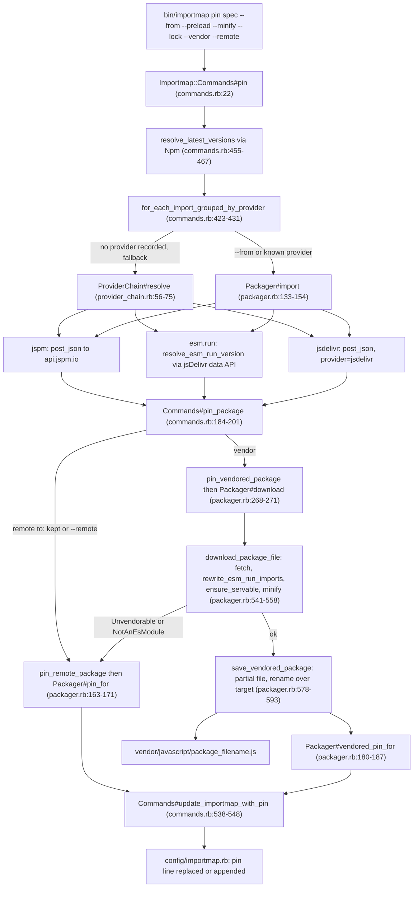

# Packager

`Importmap::Packager` (`lib/importmap/packager.rb`) is the command-path collaborator that turns a package spec into a pin: it resolves a package's ES module URL from **api.jspm.io** (`Packager.endpoint`, `import`, packager.rb:90-91,133-154), from **esm.run/jsDelivr's bundling endpoint** (`https://cdn.jsdelivr.net/npm/…/+esm`, resolved through jsDelivr's data API at `Packager.esm_run_resolver`, packager.rb:93-94,621-652), or from any CDN named in `PROVIDER_HOSTS` (unpkg, jsdelivr, skypack, esm.sh, packager.rb:19-25); it then downloads, inspects and vendors the file, or leaves it pinned remote. `Importmap::ProviderChain` (`lib/importmap/provider_chain.rb`) sits above it and walks jspm → esm.run → jsdelivr for a package that names no CDN of its own. Nothing here talks to the npm registry directly — that is `Importmap::Npm` — but `ProviderChain` and `Packager` are the only classes that reach a CDN at all; per CLAUDE.md's "no network access on the request path" rule, the engine, `Map` and the helpers never call in here. The governing invariant (CLAUDE.md, "The pin-line contract") is that every line `Packager` writes to `config/importmap.rb` must still parse under plain upstream importmap-rails: the regexes below are the only parser, there is no AST, and a rewrite touches nothing on the line it didn't come to change.

## The pin-line contract, as implemented

| Constant | Source | Matches | Accepts | Rejects |
|---|---|---|---|---|
| `PIN_REGEX` | `/#{Importmap::Map::PIN_REGEX}(.*)/.freeze` (packager.rb:11), built on `Importmap::Map::PIN_REGEX = /^pin\s+["']([^"']+)["']/.freeze` (map.rb:6) | a pin's package name (capture 1) plus everything after it on the line (capture 2) | `pin "md5", to: "https://cdn/md5.js"` | `typo "react", to: "…"` (fixture `invalid_import_map.rb`) — no leading `pin` keyword |
| `PRELOAD_OPTION_REGEXP` | `/preload:\s*(\[[^\]]+\]|true|false|["'][^"']*["'])/.freeze` (packager.rb:12) | a `preload:` value that is an array literal, a boolean, or a quoted string | `preload: ["foo", "bar"]`, `preload: false` | `preload: foo` — bare, unquoted word matches none of the three alternatives |
| `TO_OPTION_REGEXP` | `/to:\s*["']([^"']*)["']/.freeze` (packager.rb:13) | a quoted `to:` target | `to: "@popperjs--core.js"` | `to: popperjs-core.js` — unquoted |
| `INTEGRITY_OPTION_REGEXP` | `/integrity:\s*(true|false)\b/.freeze` (packager.rb:16) | only the boolean form | `integrity: true` | `integrity: "sha384-…"` — deliberately: a hash string is tied to the file it was computed for, so a rewrite that changes the URL must drop it rather than carry a stale one (comment, packager.rb:14-15) |
| `REMOTE_URL_REGEXP` | `%r{\Ahttps?://}.freeze` (packager.rb:17) | an absolute http(s) URL | `https://ga.jspm.io/npm:react@17.0.2/index.js` | `@popperjs--core.js` — a vendored filename |
| `ESM_RUN_URL_REGEXP` | `%r{\Ahttps://cdn\.jsdelivr\.net/npm/.+/\+esm\z}.freeze` (packager.rb:31) | a jsDelivr bundle URL specifically | `https://cdn.jsdelivr.net/npm/md5@2.2.0/+esm` | `https://cdn.jsdelivr.net/npm/md5@2.2.0/md5.js` — a plain jsDelivr file, reported as provider `"jsdelivr"` not `"esm.run"` (test/packager_test.rb:281-285) |
| `ESM_RUN_IMPORT_REGEXP` | `%r{((?:\bfrom|\bimport)\s*\(?\s*)(["'])/npm/((?:@[^/"'@]+/)?[^/"'@]+)@([^/"']+)((?:/[^"']*?)?)/\+esm\2}.freeze` (packager.rb:39-40) | a bundle's own `from"/npm/dep@ver/+esm"` / `import(...)` / `export … from …` imports, anchored on the keyword so it never touches JavaScript, not just strings that look like it | `import a from"/npm/charenc@0.0.2/+esm"` | `const u="/npm/sneaky@1.0.0/+esm"` — not preceded by `from`/`import` (test/packager_test.rb:413-433 asserts this string is left untouched) |
| `PACKAGE_SPEC_REGEXP` | `%r{\A(@[^@/]+/[^@/]+|[^@/]+)(?:@([^/]+))?(/.+)?\z}.freeze` (packager.rb:43) | `name[@version][/subpath]`, a leading `@` marking a scoped name apart from an unscoped name with a subpath | `apexcharts@7.1.0/core`, `@hotwired/stimulus@3` | `@scope-only` — a scoped-looking name with no `/pkg` segment matches neither alternative |
| `PIN_PROVENANCE_REGEXP` | `/#\s*@([^\s(]+)(?:\s+\(([^)]*)\))?/.freeze` (packager.rb:47) | the version comment: version (capture 1) plus the optional parenthesised detail list (capture 2) | `# @3.7.2 (esm.run, minified)` | `pin "md5"` with no comment at all — nothing to match |
| `LOCK_DETAIL_REGEXP` | `/\Alocked(?::\s*(.+))?\z/.freeze` (packager.rb:53) | the bare `locked` detail or a reserved range form `locked: <range>` | `locked`, `locked: ^2.0.0` | `lock` — the anchored `\Alocked…\z` requires the full word |
| `REMOTE_DETAIL_REGEXP` | `/\Aremote(?::\s*(.+))?\z/.freeze` (packager.rb:62) | the bare `remote` detail or `remote: <reason>` | `remote: relative imports` | `remotely` — anchored, so trailing characters after `remote` fail the match |

`VENDORED_DETAIL = "vendored"` (packager.rb:63) has no regexp of its own — it is read and written as a literal string in the detail list, same as `LOCK_DETAIL = "locked"` (packager.rb:52).

## Provenance comment grammar

The comment a vendored or remote pin carries is built by `provenance_comment` (packager.rb:401-412) and read back by `provenance_of` (packager.rb:370-380):

```
# @<version>[ (<provider>[, minified][, vendored][, remote[: <reason>]][, locked])]
```

Tokens, in the fixed order `provenance_comment` emits them:

- **version** — always present, `@` prefix stripped on write (`version.to_s.delete_prefix("@")`, packager.rb:411) and stripped on the reserved-lock form too.
- **provider** — a `PROVIDER_HOSTS` name or `"esm.run"`; omitted when it equals `DEFAULT_PROVIDER = "jspm.io"` (packager.rb:64,405).
- **minified** — the literal `"minified"`, written when `minified:` is truthy (packager.rb:406).
- **vendored** — the literal `"vendored"`, marking a pin vendored on purpose despite the single-file check (packager.rb:407,313-318).
- **remote** — bare `"remote"` for `remote: true`, or `"remote: <reason>"` for a string reason (packager.rb:408).
- **locked** — the literal `"locked"`, always last (packager.rb:409; also documented at packager.rb:48-51 and exercised by test/packager_test.rb:892-903 "pin_for records why a pin was kept remote, with the lock last").

Reading (`provenance_of`, packager.rb:370-380) does the reverse: it splits the detail list on commas, pulls `"minified"` out by membership, treats anything left after removing the lock as the lock check (`without_lock`, packager.rb:382-384), then strips vendored/remote details before taking **the first remaining detail as the provider** (`without_named_details`, packager.rb:386-390) — the comment in that method is explicit that every named detail must come out first or `"vendored"`/`"remote: workers"` would be misread as a CDN name. `remote_detail_of` (packager.rb:392-399) returns the reason string when there is one, `true` for a bare `remote`, or `nil`.

`vendored_pin_for` and `pin_for` are the only writers of a version comment; both delegate to `provenance_comment`. Reserved range locks (`locked: <range>`) round-trip through `LOCK_DETAIL_REGEXP`'s capture but no method currently writes one — test/packager_test.rb:574-589 ("pin_provenance reads a lock back, including the reserved range form") reads it back only.

## Rewrite paths

`Packager` doesn't itself run the CLI verbs — `Importmap::Commands` (`lib/importmap/commands.rb`) orchestrates `pin`, `update`, `pristine` and `unpin` — but every line those verbs write goes through these `Packager` methods, and each preserves `preload:`, `integrity:`, `to:` and the provenance comment the same way:

- **`pin_for(package, url = nil, preloads:, integrity:, locked:, remote:)`** (packager.rb:163-171) — builds a remote or bare pin line. `preload` and `integrity` are re-emitted verbatim from whatever the caller passed in (commands.rb's `pin_package`, commands.rb:184-201, reads them off the *existing* pin via `extract_existing_pin_options` before calling this, so a rewrite that only changes the URL doesn't drop them). A version comment is written only when `locked` or `remote` is set, and it is derived from the URL (`extract_package_version_from(url.to_s)`, packager.rb:167) — a plain remote re-pin with neither carries no comment at all.
- **`vendored_pin_for(package, url, preloads = nil, minify:, integrity:, locked:, vendored:)`** (packager.rb:180-187) — the vendored counterpart. It always writes a comment (version plus provider/minified/vendored/locked), and it computes `to:` itself: `to = "#{package}.js" != filename ? filename : nil` (packager.rb:183), i.e. `to:` appears only when `package_filename` doesn't match the bare `<package>.js` convention (a scoped or nested package, e.g. `@hotwired/stimulus` → `@hotwired--stimulus.js`).
- **`locked_pin_line(package)`** (packager.rb:238-248) / **`unlocked_pin_line(package)`** (packager.rb:251-255) — both call `rewrite_provenance` (packager.rb:414-423), which substitutes only the `PIN_PROVENANCE_REGEXP` match on the line and hands the block the existing detail list; everything else on the line — `to:`, `preload:`, `integrity:` — is untouched because the substitution's scope is the comment alone. `locked_pin_line` on a pin with **no** comment yet falls back to synthesizing one from a remote `to:` URL's version (packager.rb:244-246); on a pin with no version anywhere it returns `nil` (test/packager_test.rb:680-693).
- **`remove(package)`** (packager.rb:273-276, the CLI's `unpin`) — calls `remove_existing_package_file` (deletes the vendored file, packager.rb:361-363) then `remove_package_from_importmap` (packager.rb:526-533), which filters the pin's line out with `Importmap::Map.pin_line_regexp_for(package)` and rewrites the whole file. A remote pin has no vendored file to remove, so `FileUtils.rm_rf` on a path that never existed is a no-op.

A remote pin (`to:` matching `REMOTE_URL_REGEXP`) versus a vendored one differ in which of `pin_for` / `vendored_pin_for` gets called and in what the comment can say: only a vendored pin can carry `vendored`, `minified` or a bare-file `to:`; only a remote pin's comment can carry `remote`. `commands.rb`'s `pin_package` (commands.rb:184-201) is the decision point — it is outside this file but is the only caller that chooses between them, based on `packager.vendored?`, an existing remote `to:`, and the `--remote`/`--vendor` flags.

## Resolution

`import(*packages, env:, from:)` (packager.rb:133-154) is the single resolution entry point. `from: "esm.run"` (checked via `esm_run?`, packager.rb:333-335) short-circuits to `import_from_esm_run` (packager.rb:621-633), which resolves each spec's version through jsDelivr's data API one at a time (`resolve_esm_run_version`, packager.rb:635-652) and returns `+esm` bundle URLs directly — no `api.jspm.io` round trip. Every other provider posts to `Packager.endpoint` (`post_json`, packager.rb:480-488) with `provider: normalize_provider(from)` (packager.rb:490-492, `"jspm"` → `"jspm.io"`); a `200` extracts `imports` from the response (packager.rb:494-501), a `404`/`401` is recorded in `last_import_error` and returns `nil` rather than raising — one spec a CDN can't serve must not end a whole batch (comment, packager.rb:121-125) — and anything else raises `ServiceError` or `HTTPError` (`handle_failure_response`, packager.rb:503-509).

When no version is given, resolution differs by path: on jspm/unpkg/jsdelivr/skypack/esm.sh the CDN's own generator picks a version as part of resolving the install; on esm.run, `resolve_esm_run_version` asks jsDelivr's `data.jsdelivr.com/v1/packages/npm/<name>/resolved[?specifier=<requested>]` and returns its `"version"` field, or `nil` on a `404` (packager.rb:642-646, test/packager_test.rb:287-331).

`Importmap::ProviderChain#resolve(packager, specs, env:)` (provider_chain.rb:56-75) is the fallback across CDNs for a package that names none of its own — jspm is tried first because its generator can build an ES module for packages that ship none (provider_chain.rb:5-11), then `esm.run`, then `jsdelivr` (`PROVIDERS`, provider_chain.rb:17). A CDN answering "no package" moves to the next; a transport error (`Packager::Error`) is remembered and re-raised only once every provider has been tried and none answered (provider_chain.rb:56-75) — a real outage ends the run, a plain miss doesn't. Only the default chain gets this fallback (`for_each_import_grouped_by_provider`'s `fallback:` flag in commands.rb:423-431); an explicit `--from` or a pin's already-recorded provider is a choice asked once.

An esm.run bundle is jsDelivr's single minified ES file per package with its own dependencies imported as `/npm/dep@ver/+esm` (comment, packager.rb:27-28). `download_package_file` (packager.rb:541-558) calls `rewrite_esm_run_imports` (packager.rb:597-619) whenever the source URL matches `ESM_RUN_URL_REGEXP`, turning each such import into a bare specifier and collecting `[key, url]` dependency pairs to be pinned afterward (`pin_esm_run_dependencies`, commands.rb:381-389). If the same dependency is imported at two different versions, `rewrite_esm_run_imports` keeps the first version seen and warns rather than picking silently (packager.rb:609-616, test/packager_test.rb:390-411).

`--minify` runs after the esm.run rewrite and before the module-standalone check's result is used to save: `source = self.class.minifier.call(source) if minify` (packager.rb:550), i.e. `Importmap::Minifier` (a separate fork-only file) is a transform over already-CDN-resolved text — it never touches import specifiers, matching CLAUDE.md's rule 3.

## Vendoring a file graph

A download whose only obstacle is relative imports brings its siblings with it.
`download_package_file` calls `Importmap::PackageGraph.for_download` (see
`../inspection-and-tools/summary.md`) before `ensure_servable`, so the check
runs on the entry as it will be written — every relative specifier already a bare
key — and passes. `Packager#last_graph` is how the CLI learns the sibling count
and whether a line is due, a second channel rather than a second return value,
because `#download`'s is the esm.run dependency list every caller destructures.

The files land through `Importmap::VendoredGraph` (`#vendored_graph(package)`):
one directory per pin, replaced whole, mapped by one `pin_all_from` line that
`#graph_pin_for` renders with the entry's own `preload:`. The entry and the
directory are one unit, so `#save_vendored_package` builds both partials before
committing either — a new entry beside an old directory is as broken as the
reverse. `download(graph:)` is the caller's decision: `pin --vendor` passes false
(the entry alone, and the directory it had goes), `pristine` passes whether the
pin already maps one (restore, never re-decide).

## Vendoring

`download(package, url, minify:, force:)` (packager.rb:268-271) ensures `vendor_path` exists then calls `download_package_file` (packager.rb:541-558): fetch via `with_retries` → rewrite esm.run imports if applicable → `ensure_servable(source) unless force` → minify if asked → `save_vendored_package`. `ensure_servable` (packager.rb:563-568) runs `Importmap::ModuleInspector` and raises `Unvendorable` (needs sibling files: relative imports, workers, etc. — reasons listed, packager.rb:70-80) or `NotAnEsModule` (a CommonJS/UMD bundle, packager.rb:82-88) *before anything is written*, so a vendored file an app already has survives a refused re-download (test/packager_test.rb:718-761). `force: true` skips `ensure_servable` — but not when the pin maps a graph the CDN didn't give one for (`unless force && (@last_graph || !graph)`): `--vendor` passes `graph: false` and skips the check outright, while `pristine --from skypack` on a graphed pin is checked, refused and reported rather than writing an entry whose relative imports resolve nowhere.

`vendored_package_path(package)` (packager.rb:658-660) joins `vendor_path` with `package_filename(package)` (packager.rb:662-664, `package.gsub("/", "--") + ".js"`) — the only place that builds a vendored path from user input, per coding-style.md. `save_vendored_package` (packager.rb:578-593) writes to a pid-suffixed partial (`<target>.<pid>.download`) inside the vendor directory, writes the `// <package>@<version> downloaded from <url>[ (minified)]` header plus the source with any `//# sourceMappingURL=` comment stripped (`remove_sourcemap_comment_from`, packager.rb:654-656), removes an existing directory in the target's way, then `File.rename`s the partial over the target — an atomic replace. On any failure (including a `File.rename` raising `Errno::ENOSPC`) the `rescue` clears the partial and re-raises, leaving the file an app already had in place (packager.rb:590-592, test/packager_test.rb:796-816 "download leaves the file an app has when the replacement can't be written").

## Retries

Both `post_json` (packager.rb:480-488, the jspm/unpkg/jsdelivr/skypack/esm.sh path), `download_package_file`'s `Net::HTTP.get_response` (packager.rb:542) and `resolve_esm_run_version`'s request (packager.rb:640) run inside `with_retries` from `Importmap::HttpRetries` (http_retries.rb:17-34), included at packager.rb:9. It retries `RETRYABLE_ERRORS` (`SocketError`, `SystemCallError`, `Timeout::Error`, `EOFError`, `OpenSSL::SSL::SSLError`, `Net::ProtocolError`, http_retries.rb:9) and `RETRYABLE_CODES` (`429 500 502 503 504`, http_retries.rb:10) up to `HttpRetries.attempts` (default 3) times, sleeping `HttpRetries.wait * attempt` between tries (http_retries.rb:32), then raises `self.class::HTTPError` — resolved per-includer, so it raises `Importmap::Packager::HTTPError` here (packager.rb:66-67) and `Importmap::Npm::HTTPError` in that class. `post_json` additionally wraps any other exception in `HTTPError` (packager.rb:484-488) so nothing but `Packager::Error`/subclasses escapes a resolution call — the shape `ProviderChain#resolve` depends on (provider_chain.rb:64).

## Invariants and contracts

- A rewrite of `pin_for`/`vendored_pin_for` never drops `preload:`/`integrity:` it was given, and both option regexes only ever read quoted or literal-boolean forms — test/packager_test.rb:51-82 ("pin_for", "vendored_pin_for"), test/packager_test.rb:151-160 ("pin_for and vendored_pin_for keep a boolean integrity").
- `locked_pin_line`/`unlocked_pin_line` touch only the version comment, leaving `to:`, `preload:` and any remote/vendored detail alone — test/packager_test.rb:660-679, 913-934 ("locked_pin_line and unlocked_pin_line keep the remote and vendored details").
- The provider is read as the first *unnamed* detail, so `vendored`/`remote: …`/`locked` are never mistaken for a CDN — test/packager_test.rb:854-880 ("pin_provenance reads a remote reason back without mistaking it for a provider", "… reads a bare remote detail and a vendored detail").
- A download that can't stand alone or isn't an ES module is refused before anything is written, and the file an app already has survives — test/packager_test.rb:718-761, 796-816.
- `--vendor`/`force: true` is the one override for both checks — test/packager_test.rb:762-780, 818-834.
- An esm.run bundle's own `/npm/…/+esm` imports become bare specifiers and nothing else in the file is touched — test/packager_test.rb:341-373, 413-433.
- A dependency imported at two versions keeps the first and warns rather than silently overwriting — test/packager_test.rb:390-411.
- Every CDN request retries transport errors and `429`/`5xx` up to `HttpRetries.attempts`, then raises `HTTPError` with the transport error's message — test/packager_test.rb:488-526.
- `ProviderChain#resolve` moves to the next provider on a miss but re-raises a real transport error once the chain is exhausted — provider_chain.rb:56-75 (`test/provider_chain_test.rb`, 13 cases with a `FakePackager`; the live fallback path is in commands_test.rb).
- A single quote pin file (`pin 'md5', to: '…'`) round-trips through the same regexes as double quotes — test/packager_single_quotes_test.rb:12-20.
- Live-contract shape (real jspm/jsDelivr): test/packager_integration_test.rb:9-65.

## `pin` flow



## Related

- [../cli/summary.md](../cli/summary.md)
- [../inspection-and-tools/summary.md](../inspection-and-tools/summary.md)
- [../review/packager.md](../review/packager.md)
- [../lode-map.md](../lode-map.md)
