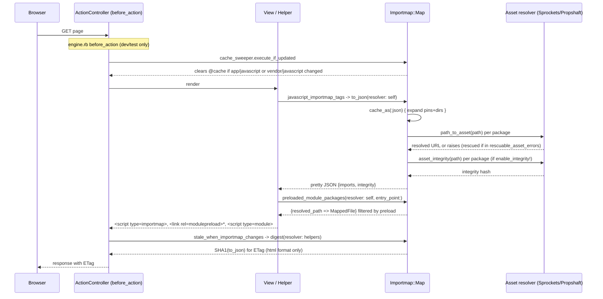

# Request path

## What this does, and the governing invariant

The request path renders an app's import map into HTML: an `Importmap::Map` built once at boot from `config/importmap.rb` is turned into JSON, ``.
- `javascript_inline_importmap_tag(importmap_json = ...to_json(resolver: self))` (`:13-16`) — one `<script type="importmap" data-turbo-track="reload">`, carrying the CSP nonce off `request&.content_security_policy_nonce` when present.
- `javascript_import_module_tag(*module_names)` (`:19-22`) — one `<script type="module">` containing one `import "<name>"` per argument.
- `javascript_importmap_module_preload_tags(importmap = ..., entry_point: "application")` (`:27-31`) — resolves `preloaded_module_packages` for that importmap/entry_point (cached under the entry point name) and emits one `<link rel="modulepreload">` per resolved path, `integrity:` set from the package.
- `javascript_module_preload_tag(*paths)` (`:34-36`) — same tag shape for arbitrary already-resolved paths, no integrity.
- All four preload/module tags funnel through the private `_generate_preload_tags` (`:39-46`), which also attaches the CSP nonce.

`Importmap::Freshness` (`app/controllers/importmap/freshness.rb:1-5`) exposes `stale_when_importmap_changes`, a class-level `etag { ... }` declaration (extended onto `ActionController::Base` by `engine.rb:53`) that adds `Rails.application.importmap.digest(resolver: helpers)` to the response's ETag computation, but only `if request.format&.html?`. This is how an import-map change (a new pin, a changed asset digest) busts an HTML page's browser/CDN cache without touching non-HTML responses.

## Both asset pipelines

The request-path code itself branches on pipeline presence only once, at boot: `engine.rb:64-70` registers `Propshaft::MissingAssetError` and/or `Sprockets::Rails::Helper::AssetNotFound` as rescuable, whichever is `defined?`. Nothing else in `map.rb`, the helpers, or the reloader inspects which pipeline is active — both resolvers are used purely through the duck-typed `path_to_asset` / `asset_integrity` interface.

The divergence shows up in test expectations, gated by `ENV["ASSETS_PIPELINE"]` (set by `.github/workflows/ci.yml:56` from the CI matrix's `assets-pipeline`, `ci.yml:28-51`; not read by any lib code):
- `test/importmap_test.rb:160-164` — `enable_integrity!` + `integrity: true` on `application`: under sprockets the expected hash is `sha256-47DEQpj8HBSa+/TImW+5JCeuQeRkm5NMpJWZG3hSuFU=` (a raw content digest of the empty test fixture), under anything else the pinned `sha384-...` literal for `rich_text.js`'s content is asserted instead.
- `test/importmap_test.rb:403-407` — same split for a `pin_all_from`-expanded file's dynamically calculated integrity (`sha256-6yWqFiaT8vQURc/OiKuIrEv9e/y4DMV/7nh7s5o3svA=` for sprockets vs a `sha384-...` value otherwise).

Both cases exist because `resolver.asset_integrity` (called from `map.rb:261`) is implemented differently per pipeline — Sprockets computes SHA-256 over the compiled asset, the alternative path (Propshaft, per `CLAUDE.md`'s note that Propshaft integrity needs `config.assets.integrity_hash_algorithm` configured) produces SHA-384 — `Importmap::Map` itself is agnostic and just forwards whatever the resolver returns.

## Invariants and contracts

- A pin's `preload` and `integrity` survive to the final `to_json`/`preloaded_module_packages` output unless integrity is globally disabled — `test/importmap_test.rb:44-51` ("integrity is not on by default"), `:65-79` (`false`/`nil` explicitly disable it), `:81-92` (a custom string is passed through verbatim).
- A pin whose local asset can't be resolved is silently dropped from `imports` and `integrity`, never raises — `test/importmap_test.rb:94-96`, `:167-176`, `:379-391`, backed by `map.rb:222-233`'s rescue of `rescuable_asset_error?`.
- A remote (`https://...`) pin's path passes through `to_json` unchanged, never digest-stamped — `test/importmap_test.rb:98-100`.
- `pin_all_from` directory expansion honours `under:`/`to:`, treats a bare `index` file as the directory's own module, and does not treat `*_index` files the same way, at any nesting depth — `test/importmap_test.rb:102-131`.
- A filename containing `js` as a substring but not a `.js`/`.jsm` extension is excluded; one that legitimately ends `.jszip`/`.jsmin` is *not* mistaken for `.js` — `test/importmap_test.rb:137-146`, `map.rb:312-313`'s glob `**/*.js{,m}`.
- `preload:` accepts `true`/`false` (always/never) or a string/array naming entry points, and `preloaded_module_paths`/`preloaded_module_packages` filter accordingly — `test/importmap_test.rb:203-328`, `map.rb:267-269`.
- `digest` is a 40-character hex SHA1 of the resolved JSON — `test/importmap_test.rb:232-234`.
- Every cache is keyed by `cache_key` and invalidated in full by any `pin`/`pin_all_from`/`draw`/`enable_integrity!` call — `test/importmap_test.rb:236-256`, `:357-377`, via `map.rb:200-210`.
- An invalid `config/importmap.rb` raises `Importmap::Map::InvalidFile` rather than a bare `StandardError` — `test/importmap_test.rb:195-201`, `map.rb:24-27`.
- A file-watcher change to a watched `config/importmap.rb` path is picked up by `Reloader#execute_if_updated`/`reload!`, replacing the app's pinned packages in place — `test/reloader_test.rb:9-23`.
- Inline importmap, preload links and the entrypoint's module import all carry the request's CSP nonce, and are nonce-free when no CSP is configured — `test/importmap_tags_helper_test.rb:52-68`.
- `javascript_importmap_tags` accepts an alternate `importmap:` instance instead of `Rails.application.importmap`, and its output correctly reflects that instance's own pins/preloads — `test/importmap_tags_helper_test.rb:70-82`.

## Request sequence

## Related

- [../packager/summary.md](../packager/summary.md)
- [../cli/summary.md](../cli/summary.md)
- [../lode-map.md](../lode-map.md)
