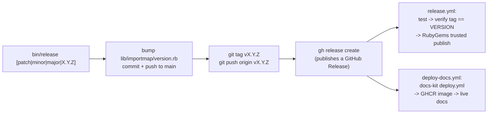

# Testing and CI

The rules are `../../.claude/rules/testing.md` (TDD workflow, Minitest conventions, coverage targets) and `../../.claude/rules/git-workflow.md` (pre-push checklist, lockfiles). This file is the concrete shape: which files exist, what each one actually asserts, which ones touch the network, and how the matrix and release pipeline are wired today. See also `../lode-map.md`.

## Test files (`test/*.rb`)

| File | Network | Covers |
|---|---|---|
| `test_helper.rb` | none | boots `test/dummy`, wires engine fixtures for both old (`fixture_path=`) and new (`fixture_paths=`) Rails APIs |
| `importmap_test.rb` (37 tests) | none | `Importmap::Map` DSL end to end against a map drawn in `setup` — local/remote/`pin_all_from` pins, `preload:` variants, integrity hashes, `to_json`, caching, digest |
| `importmap_tags_helper_test.rb` (5 tests) | none | `javascript_importmap_tags` and friends via `ActionView::TestCase`, including CSP nonce handling (`FakeRequest`) |
| `reloader_test.rb` (2 tests) | none | `Importmap::Reloader` re-draws `Rails.application.importmap` when `config/importmap.rb`'s mtime changes |
| `module_inspector_test.rb` (19 tests) | none | `Importmap::ModuleInspector#vendorable?`/`reasons` — bare vs relative vs dynamic imports, worker construction, `import.meta`, `export from` forms |
| `provider_chain_test.rb` (13 tests) | none | `Importmap::ProviderChain` — CDN fallback order, reason propagation, error vs "answered nothing" distinction, via a `FakePackager` test double, no real `Importmap::Packager` involved |
| `packager_test.rb` (65 tests) | stubbed | `Importmap::Packager` — pin-line parsing/rewriting (`extract_existing_pin_options`, `pin_for`, `vendored_pin_for`), esm.run import rewriting and dependency reporting, provenance, retries. Network calls stubbed with `@packager.stub(:post_json, response)` (a tiny object responding to `code`/`body`) or `Net::HTTP.stub(:get_response, ...)`/`Net::HTTP.stub(:post, ...)` |
| `packager_single_quotes_test.rb` (2 tests) | none | the same pin-line regexes against a config file rewritten with single quotes |
| `npm_test.rb` (26 tests) | stubbed | `Importmap::Npm#outdated_packages`/`vulnerable_packages` — version comparison, scoped/nested package names, retries, malformed responses. Stubbed with `@npm.stub(:get_json, response)` (a JSON string) |
| `minifier_test.rb` (5 tests) | filesystem only | `Importmap::Minifier` tool discovery (`node_modules/.bin` before `PATH`), Windows `.cmd` shim lookup, the "no minifier" error; one test runs a real minifier when present |
| `commands_test.rb` (81 tests) | **live**: jspm (`ga.jspm.io`), jsDelivr/esm.run, npm registry | `bin/importmap` end to end — `pin`, `update`, `pristine`, `lock`/`unlock`, `outdated`, `json`, `--remote`, `--from esm.run`, `--minify`, `--lock`, `--vendor`, `--force`, provider fallback (jspm -> esm.run -> jsDelivr) |
| `packager_integration_test.rb` (5 tests) | **live** | `Packager#import`/`download`/`remove` against the real jspm API and a real download, including the `Unvendorable` refusal path |
| `npm_integration_test.rb` (4 tests) | **live** | `Npm#outdated_packages`/`vulnerable_packages` against the real npm registry, plus a deliberately bad domain to exercise `HTTPError` |
| `installer_test.rb` (3 tests) | **live** (`bundle install` inside a generated app) | `rails importmap:install` generator output, run inside a real `rails new` app in a tmpdir |

Total: 14 files under `test/` outside `dummy/` and `fixtures/` (13 `*_test.rb` plus `test_helper.rb`). `bin/test` is upstream's rails/plugin runner and runs 0 tests on Rails 8.1 per `CLAUDE.md` — don't use it; `bundle exec rake test` is the entry point.

## CommandsTest process isolation

`CommandsTest` and `InstallerTest` `include ActiveSupport::Testing::Isolation` (`test/commands_test.rb:5`, `test/installer_test.rb:5`): **each test method runs in a forked process**. `setup` copies `test/dummy` into a fresh `Dir.mktmpdir` and `Dir.chdir`s into it (`test/commands_test.rb:7-10`); `teardown` removes it. Implications:

- No state leaks between tests — but nothing is shared either, so nothing here can rely on ordering or a previous test's output.
- `run_importmap_command(command, *args)` (defined around `test/commands_test.rb:1081`) shells out to the real `bin/importmap` with `system`/`capture_subprocess_io` and **flunks with the CLI's own stdout/stderr** when it exits non-zero — a failure message already contains the live CDN's actual response.
- `importmap_config(content)` (`test/commands_test.rb:1075`) overwrites `config/importmap.rb` in the tmpdir copy before running a command.
- A fork per test is why this file is slow and why it is the one place allowed to talk to live services on every push to `main` and every PR.

## Fixtures (`test/fixtures/files/`)

| File | Shape it exercises |
|---|---|
| `outdated_import_map.rb` | one pin (`md5@2.2.0`) behind on the registry |
| `single_quote_outdated_import_map.rb` | same, written with `'...'` instead of `"..."` |
| `single_quote_outdated_import_map_without_cdn.rb` | single-quoted pin with no CDN comment |
| `import_map_without_cdn_and_versions.rb` | a pin with neither a version nor a provider comment |
| `locked_import_map.rb` | a pin carrying the `locked` provenance flag |
| `nested_package_path_import_map.rb` | a pin whose key is a subpath of the package (`pkg/sub`) |
| `nested_package_with_comment_import_map.rb` | same, plus a version/provider comment |
| `scoped_package_import_map.rb` | an `@scope/name` package |
| `scoped_package_with_nested_path_import_map.rb` | `@scope/name` with a subpath key |
| `remote_reason_import_map.rb` | a pin kept remote, with the "why" recorded |
| `vulnerable_import_map.rb` | packages with known npm advisories, for `Npm#vulnerable_packages` |
| `invalid_import_map.rb` | a config file that fails to parse |

Each fixture is a real `config/importmap.rb` exercising one pin-line shape, per `.claude/rules/testing.md`.

## Appraisals and `gemfiles/`

`Appraisals` defines 10 appraisals; `gemfiles/*.gemfile` (checked in, `*.gemfile.lock` gitignored) mirrors each one:

- `rails_6.1_sprockets` (adds `logger`, `mutex_m`, `drb`, `bigdecimal`, `sqlite3 ~> 1.4`, no propshaft)
- `rails_7.0_sprockets`, `rails_7.0_propshaft` (rails pinned to the `7-0-stable` branch on GitHub)
- `rails_7.1_sprockets`, `rails_7.1_propshaft`
- `rails_7.2_sprockets`, `rails_7.2_propshaft`
- `rails_8.0_propshaft` (no sprockets cell)
- `rails_8.1_propshaft` (no sprockets cell)
- `rails_main_propshaft` (rails from the `main` branch, no sprockets cell)

`bundle exec appraisal generate` regenerates the `gemfiles/*.gemfile` files after editing `Appraisals`.

## `.github/workflows/ci.yml`

- `on: push: branches: [main]` + `pull_request` — a comment in the file (`.github/workflows/ci.yml:3-6`) explains why: a push to a PR branch used to trigger both a push run and a pull_request run, doubling the live-CDN traffic `commands_test.rb` generates.
- Matrix: Ruby `3.1, 3.2, 3.3, 3.4, 4.0` x Rails `6.1, 7.0, 7.1, 7.2, 8.0, 8.1, main` x pipeline `sprockets, propshaft`, with `exclude:` entries dropping `6.1`+propshaft, `3.1`/`3.2`/`4.0` against version combinations that don't support them, and `8.0`/`8.1`/`main` against sprockets.
- `BUNDLE_GEMFILE` and `ASSETS_PIPELINE` env vars select the cell; the cell's `.gemfile.lock` is deleted before `bundle install` so every run resolves fresh.
- Installs `bun` (`oven-sh/setup-bun@v2`) specifically so the `--minify` command tests don't skip — a comment says so directly.
- Runs `bundle exec rake` (default task, i.e. `rake test`).

## `release.yml`, `deploy-docs.yml`, `docs-ci.yml`

- **`release.yml`** — fires on a published GitHub Release (or manual dispatch with a tag). Re-runs `bundle exec rake test` against the release tag, then verifies the tag matches `Importmap::VERSION` and pushes to RubyGems via trusted publishing (OIDC, no API key). Every action is pinned to a commit SHA, not a moving tag, because the push job holds `id-token: write`.
- **`deploy-docs.yml`** — also fires on a published Release (or manual dispatch), calling docs-kit's reusable `deploy.yml` workflow (pinned to a specific commit) with `image: zoolutions/importmap-plus`, `service: importmap-plus`; needs `packages: write` to push the built docs image to GHCR.
- **`docs-ci.yml`** — separate job, `defaults: run: working-directory: docs`, triggered on paths `docs/**`, `app/**`, `lib/**`, `importmap-plus.gemspec`, `CHANGELOG.md`, `.bun-version`, or itself; sets up Ruby + Bun, syncs lucide icons, builds CSS, then `bundle exec rake lint` and `bundle exec rspec`. Has its own `concurrency` group that cancels superseded runs on the same ref.

## `bin/release`

Bash script (`bin/release`): computes the next version from `lib/importmap/version.rb` (`patch` default, or `minor`/`major`/an explicit `X.Y.Z`), refuses a dirty tree or a non-`main` branch, `git pull --ff-only origin main`, refuses if the tag already exists. If the version file needs to change it rewrites the `VERSION = "..."` line, `bundle install`, commits "Prepare for X.Y.Z", and pushes to `main` directly (not through a PR) — otherwise (an explicit version matching what's already in the file) it tags as-is with no commit. Then `git tag -a vX.Y.Z`, pushes the tag, and `gh release create` with `--generate-notes`. `--dry-run` prints the computed version and exits without writing anything.

## The `--minify` skip condition

`Importmap::Minifier.available?` (`lib/importmap/minifier.rb`) is `!detect.nil?`, and `detect` searches `TOOLS.keys` (`bun`, `esbuild`, `terser`) via `executable_for`, which checks `node_modules/.bin` first, then every `PATH` directory, trying Windows extensions (`.COM;.EXE;.BAT;.CMD`) only under `Gem.win_platform?`. `commands_test.rb`'s two `--minify` tests (`test/commands_test.rb:350-381`) call a local `minifier_available?` helper wrapping this and `skip` with the message `"no JavaScript minifier installed (bun, esbuild or terser)"` when none is found. `minifier_test.rb`'s own minify-and-verify test uses the identical `Importmap::Minifier.available?` guard.

## Invariants

- Every unit test that writes vendors into a `Dir.mktmpdir`-backed `vendor_path`, never the real `vendor/javascript` — enforced by convention across `packager_test.rb` and `packager_integration_test.rb`, not by a shared helper.
- `CommandsTest`/`InstallerTest` never share fixtures or state between tests — enforced by `ActiveSupport::Testing::Isolation` (`test/commands_test.rb:5`).
- A class-level accessor a test overrides (`Importmap::Npm.base_uri`, `Importmap::Packager.endpoint`) is restored in an `ensure` block in the same test — see `npm_integration_test.rb:24-32` and `packager_integration_test.rb:17-24`.
- `gemfiles/*.gemfile.lock` are never committed — `ci.yml` deletes them before every run (`.github/workflows/ci.yml`'s "Remove Gemfile lock" step).
- Release version and Git tag must match byte-for-byte — enforced by `release.yml`'s "Verify the tag matches Importmap::VERSION" step, which reads the tag from `$RELEASE_TAG` (an env var, not `${{ }}` interpolation) specifically to keep the tag's characters out of shell interpolation.

## Release flow

## See also

- `../lode-map.md`
- `../../.claude/rules/testing.md`
